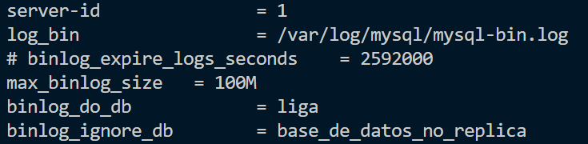

# Bases de datos replicadas
En esta [actividad](https://educacionadistancia.juntadeandalucia.es/centros/almeria/mod/assign/view.php?id=411839) vamos a hacer dos máquinas y vamos a distribuir la base de datos entre las dos. Es decir, vamos a crear una base de datos en un servidor mysql, y crearemos otro servidor que replique todas las acciones del primer servidor, para que tengamos siempre dos réplicas de la misma información, y podamos usar el servidor secundario en caso de fallo del primero.

Vamos a usar la guía de este [tutorial](https://help.clouding.io/hc/es/articles/6416333071900-C%C3%B3mo-configurar-una-replicaci%C3%B3n-MySQL)

### (para la documentación en pdf)
El link a este repositorio es el siguiente:  
https://github.com/miler2/GBD.git

Aquí tengo mis tareas documentadas en github, y esta tarea está dentro del directorio GBD/ejercicios/U6P1_bases_de_datos_replicadas.

## Configuración del servidor MySQL padre
Este archivo nos hace toda la configuración necesaria para nuestro servidor padre. No confirmo que ejecutando los scripts varias veces funcionen del todo bien. Pero si es la primera vez, siempre funciona.

Este script sigue los pasos que nos dice en la guía, solo que lo he modificado para que se pueda hacer de forma automática. Los únicos cambios que he tenido que hacer es añadir esta línea:

>\# Copiamos el archivo de configuración de mysql por defecto, para luego asegurarme de que los siguientes comandos funcionen  
>cp ../config/mysqld.cnf /etc/mysql/mysql.conf.d/mysqld.cnf

Y también para la configuración del archivo "mysqld.cnf":

>\# Cambiamos los valores del archivo mysqld.cnf  
>#sed -i "s/127.0.0.1/$IP_MYSQL_HIJO/" /etc/mysql/mysql.conf.d/mysqld.cnf        # Este no me funciona con la ip de la máquina, a si que lo dejo en 0.0.0.0  
>sed -i "s/127.0.0.1/0.0.0.0/" /etc/mysql/mysql.conf.d/mysqld.cnf  
>sed -i "s/# server-id		= 1/server-id		= 1/" /etc/mysql/mysql.conf.d/mysqld.cnf  
>sed -i "s:# log_bin			= /var/log/mysql/mysql-bin.log:log_bin			= /var/log/mysql/mysql-bin.log:" /etc/mysql/mysql.conf.d/mysqld.cnf  
>sed -i "s/# binlog_do_db		= include_database_name/binlog_do_db		= liga/" /etc/mysql/mysql.conf.d/mysqld.cnf  
>sed -i "s/# binlog_ignore_db	= include_database_name/binlog_ignore_db	= $base_de_datos_no_replica/" /etc/mysql/mysql.conf.d/mysqld.cnf

El resultado de lo comentado arriba sería este archivo de configuración (se muestra solo lo que cambia en el archivo):  


Además de crear variables para poder modificar las direcciones ip una sola vez a todas las ocurrencias.

Una cosa a tener en cuenta en la ejecución de este script es que es posible que la ejecución de un comando dentro de mysql tarde un poco más de lo normal, pero el script en bash siga. Esto puede causar problemas como que se haya ejecutado la creación del archivo dump.sql, y mientras se está creando, se intenta mandar al otro servidor, por lo que, o da error, o no se manda, porque aún no está creado. Esto se soluciona volviendo a ejecutar el script (o añadiendo el comando "sleep, pero me requeriría más tiempo de tarea que no me hace falta").


```
#!/bin/bash

# Mostramos los comandos que se ejecutan
set -ex

# Actualizamos el sistema
apt update -y

# Instalamos mysql
apt install mysql-server -y

# Importamos las variables
source .env

# Copiamos el archivo de configuración de mysql por defecto, para luego asegurarme de que los siguientes comandos funcionen
cp ../config/mysqld.cnf /etc/mysql/mysql.conf.d/mysqld.cnf

# Creamos la base de datos liga
mysql -u root < ../../../bases_de_datos/liga.sql

# Creamos un usuario personal '[tu_usuario]'@'%'
mysql -u root -e "DROP USER IF EXISTS '$usuario'@'%'"
mysql -u root -e "CREATE USER '$usuario'@'%' IDENTIFIED WITH mysql_native_password BY '$password_user_root'"
mysql -u root -e "GRANT ALL PRIVILEGES On *.* TO '$usuario'@'%'"

# Creamos otra base de datos extra (la base de datos que se ignorará)
mysql -u root -e "DROP DATABASE IF EXISTS $base_de_datos_no_replica"
mysql -u root -e "CREATE DATABASE $base_de_datos_no_replica"

# Cambiamos los valores del archivo mysqld.cnf
#sed -i "s/127.0.0.1/$IP_MYSQL_HIJO/" /etc/mysql/mysql.conf.d/mysqld.cnf        # Este no me funciona con la ip de la máquina, a si que lo dejo en 0.0.0.0
sed -i "s/127.0.0.1/0.0.0.0/" /etc/mysql/mysql.conf.d/mysqld.cnf
sed -i "s/# server-id		= 1/server-id		= 1/" /etc/mysql/mysql.conf.d/mysqld.cnf
sed -i "s:# log_bin			= /var/log/mysql/mysql-bin.log:log_bin			= /var/log/mysql/mysql-bin.log:" /etc/mysql/mysql.conf.d/mysqld.cnf
sed -i "s/# binlog_do_db		= include_database_name/binlog_do_db		= liga/" /etc/mysql/mysql.conf.d/mysqld.cnf
sed -i "s/# binlog_ignore_db	= include_database_name/binlog_ignore_db	= $base_de_datos_no_replica/" /etc/mysql/mysql.conf.d/mysqld.cnf

# Reiniamos el servicio de mysql
systemctl restart mysql

# Bloqueamos las tablas de la base de datos
mysql -u root -e "FLUSH TABLES WITH READ LOCK"

# Hacemos una copia de seguridad de la base de datos liga
mysqldump -u root liga > dump.sql

# Compartimos el archivo dump.sql con el otro ordenador (mysql_hijo)
scp -i labsuser_sad.pem dump.sql ubuntu@$IP_MYSQL_HIJO:/tmp/

# Desbloqueamos las tablas de la base de datos
mysql -u root -e "UNLOCK TABLES"
```